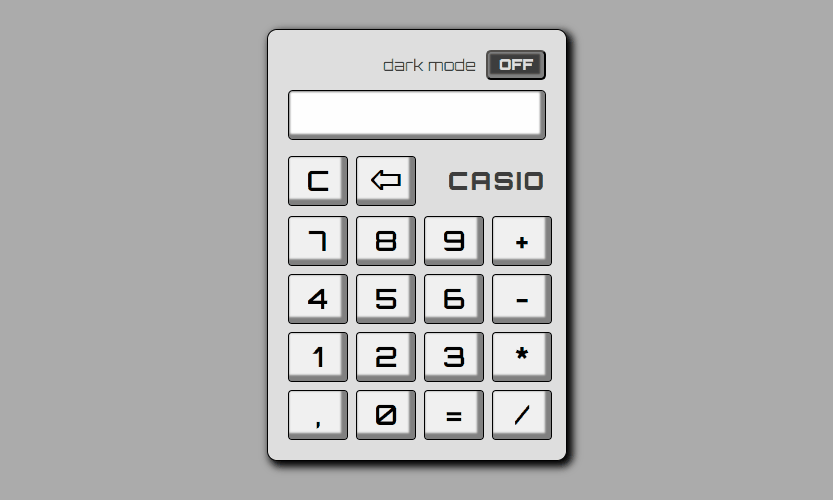

# Calculator
## Demo
Link: https://pawelnackowski.github.io/calculator-react/

## Description
This is a simple calculator written in React. This application has two themes: dark and light.

## Technologies used
